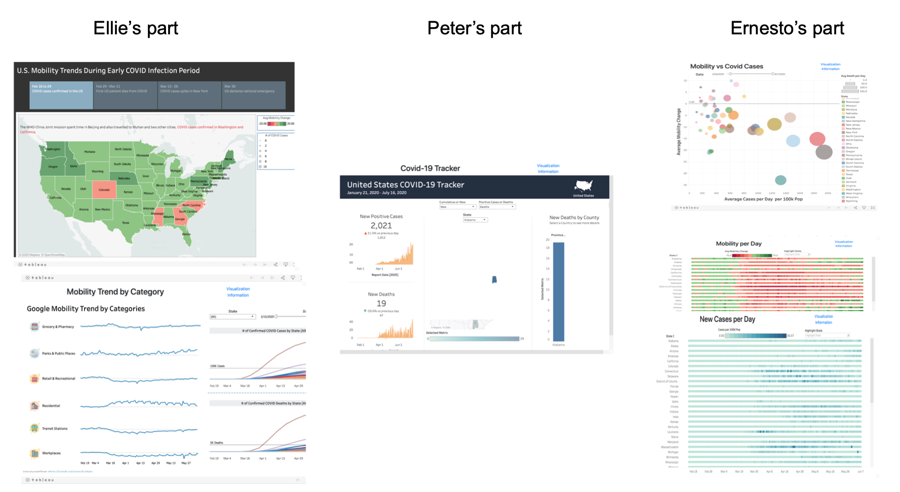

# w209_final project

 

## License
MIT License, refer to the license.md file.

## Introduction

This repository contains all the resources we have used to create MIDS W209 final project website. The repository structure is as follows

- data : It contains original mobility data & preprocessed mobility data. 

- peter/ernesto/ellie : Each folder includes Tableau workbook used for our visualization

 

- Website: This folder includes html and css file used to design our landing page.
[COVID-19: Mobillity Report](http://people.ischool.berkeley.edu/~hyunchul78/COVID19/index.html) 

